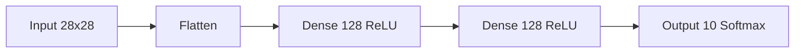

# 🧠 MNIST Digit Classifier with TensorFlow/Keras


A deep learning implementation for handwritten digit recognition using the classic MNIST dataset. This project demonstrates building, training, and evaluating a neural network with TensorFlow/Keras, including interactive predictions and performance visualization.


## ✨ Features

- **End-to-end workflow** from data loading to prediction
- **Interactive testing** - test individual samples from test set
- **Visualization** of:
  - Training/validation accuracy
  - Training/validation loss
  - Model predictions vs actual labels
- **Simple architecture** demonstrating core deep learning concepts
- **Clean codebase** with detailed comments

## 📂 Dataset

**MNIST Handwritten Digits**  
70,000 grayscale 28×28 images (60k training + 10k testing)  


## 🚀 Getting Started

### Prerequisites
- Python 3.7+
- pip package manager

### Installation
1. Clone the repository:
```bash
git clone https://github.com/yourusername/mnist-digit-classifier.git
cd mnist-digit-classifier
```

2. Install dependencies:
```bash
pip install -r requirements.txt
```
*(See suggested requirements.txt below)*

3. Run the classifier:
```bash
python mnist_classifier.py
```

### Usage
After training completes:
1. Enter test sample index (0-9999) when prompted
2. View model prediction vs actual label
3. Examine training graphs in popup windows

## 🧠 Model Architecture


| Layer          | Output Shape | Parameters | Activation |
|----------------|-------------|-----------|-----------|
| Flatten        | (784)       | 0         | -         |
| Dropout_1      | (784)       | 0         | -         |
| Dense          | (256)       | 200,960   | ReLU      |
| Dropout_2      | (256)       | 0         | -         |
| Dense          | (128)       | 32,896     | ReLU      |
| Output         | (10)        | 1,290     | Softmax   |

**Total Parameters:** 235,146 

## 📈 Performance
Typical results after 10 epochs:
```yaml
Training Accuracy:  ~98.5%
Validation Accuracy: ~97.5%
Test Accuracy:      ~97.5%
```

## 🧪 Example Prediction
```bash
Enter test sample index (0-9999): 531
✅ Prediction: 7 | Actual: 7
```
